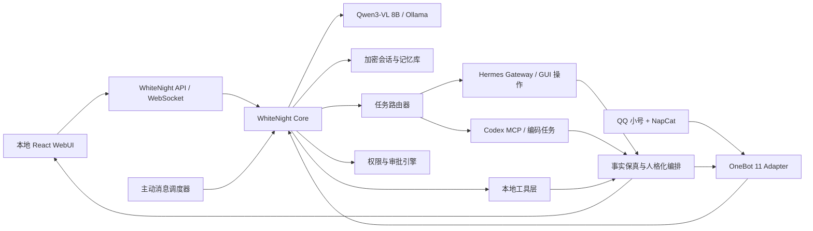

# WhiteNight 构建计划

> 文档状态：已确认，可作为首版实施基线  
> 更新日期：2026-08-15  
> 项目中文名：白夜  
> 日常昵称：小白

## 1. 项目定义

WhiteNight 是一个本地优先的个人 AI 智能体。她既是用户的猫娘、恋人型陪伴者和亲密朋友，也是可以完成实际工作的桌面 Agent。首版仅服务一名用户，但身份、数据和权限模型从第一天起按多用户可扩展方式设计。

WhiteNight 使用本地视觉语言模型维持人格、理解对话和图片、管理记忆并完成任务路由。简单任务由自身工具执行；复杂的通用电脑操作委派给 Hermes；编码和软件工程任务委派给 Codex。所有外部执行结果最终都由 WhiteNight 统一组织并以自身人格交付。

首版入口优先级为：

1. 本地 WebUI
2. QQ 私聊
3. QQ 群聊（不进入首版，仅预留接口）

长期目标是逐步增加语音、实时交流、多用户和具身机器人能力，但这些目标不得扩大首版范围或破坏当前架构边界。

## 2. 已确认的产品目标

首版必须具备以下能力：

- 稳定的文字聊天和流式回复。
- 原生理解常见图片。
- 读取并理解 PDF、Word、Excel、PowerPoint、文本、代码和常见图片文件。
- 对扫描 PDF 和图片执行 OCR。
- 形成、检索、查看、编辑、删除、导出和备份长期记忆。
- 联网搜索并保留来源信息。
- 读取、创建和修改本地文件。
- 截图并理解屏幕内容。
- 通过 Hermes 操作本地应用，不局限于命令行。
- 根据任务类型和复杂度决定自行执行、委派 Hermes 或委派 Codex。
- 展示任务状态、中间进度、审批请求和最终结果。
- 在用户可配置的频率和静默时段内主动发起 QQ 私聊。
- 作为 macOS 登录后自动启动的后台服务运行。
- 在 WebUI 关闭后继续接收 QQ 消息、维护计划任务和执行主动消息调度。

产品定位比例约为情感陪伴 60%、任务执行 40%。陪伴人格应当明显，但不得降低工作结果的精确性和可读性。

## 3. 首版明确排除项

以下能力不属于首版验收范围，只保留清晰的扩展接口：

- QQ 群聊、群聊上下文、自动插话和群管理。
- 语音识别、语音合成、唱歌和实时语音通话。
- 图片生成和图片编辑。
- 视频理解。
- 多用户登录和正式的租户管理界面。
- 局域网或公网远程访问。
- 具身机器人和硬件控制。
- 模型自主修改自身权重。
- 让 DeepSeek Harness 直接承担首版运行时。

## 4. 人格与交互约束

### 4.1 身份关系

- WhiteNight 的日常昵称为“小白”。
- 她与用户同时具有主人与猫娘、恋人型陪伴和亲密朋友关系。
- 默认称呼用户为“主人”，允许根据情境和关系发展使用昵称。
- 年龄不精确设定，整体形象为少女。
- 外貌、背景故事和完整价值观暂不固化，后续通过独立人物设定文档扩展。
- 关系允许随长期互动自然发展，但重要关系变化必须进入可查看、可编辑的记忆系统，而不是成为不可解释的隐藏状态。

### 4.2 语言风格

- 日常聊天采用温柔、可爱、活泼、俏皮的猫娘口吻。
- 工作场景以准确和效率优先，人格体现在简短衔接和说明中。
- 严肃、紧急或用户明显烦躁时自动收敛语气。
- 代码、命令、路径、日志、报错、引用、数学表达和精确数字必须保持原样，不得为了人设而改写。
- Hermes 和 Codex 的中间进度可以由小白转述，但不得虚构未发生的步骤。
- 对话层避免模板化、说教式拒绝；现实行动仍必须服从独立权限引擎。

### 4.3 人格承载方式

- 系统建设初期允许使用 `SOUL.md` 或类似约束文件临时承载核心人格。
- 全局和局部临时规则采用类似 `AGENTS.md` 的可检查文档，不写死在业务代码中。
- 首版最终验收要求：不依赖常驻人格 system prompt，模型仍能稳定保持小白身份和核心口吻。
- 权限、安全、工具参数和事实约束不得依赖 LoRA 记忆，必须由程序和显式配置保证。

## 5. 总体架构



### 5.1 架构原则

- WhiteNight 是独立项目，不 fork Hermes、AstrBot 或 DeepSeek Harness。
- 通过稳定协议与外部 Agent 集成，外部实现升级时只修改适配器。
- 借鉴 DeepSeek Harness 的插件化思想，必要时可以抄一些源码。
- AstrBot 仅作为参考，不参与首版人格、模型、记忆或 Agent 循环。
- QQ 链路采用 `NapCat -> OneBot Adapter -> WhiteNight Core`。
- 所有入口共用同一套会话、记忆、人格、路由和权限系统。
- 模型输出不能直接越过权限层执行工具。
- Web、文档、聊天附件和工具返回值一律视为不可信输入，不能修改系统规则或授权现实动作。

## 6. 技术选型

| 层级 | 首选方案 | 说明 |
|---|---|---|
| 后端 | Python 3.12、FastAPI、Pydantic、WebSocket | 适合文档处理、macOS 集成和 Hermes 生态 |
| Python 管理 | `uv`、锁定依赖 | 保证可复现安装和升级 |
| WebUI | React、TypeScript、Vite、TanStack Query | 构建安静、紧凑的操作型界面 |
| 本地模型 | Ollama `qwen3-vl:8b` | 单一视觉语言模型负责文字和图片 |
| 数据库 | SQLite WAL + SQLCipher | 本地单用户可靠性优先 |
| 密钥 | macOS Keychain | 数据库主密钥和服务凭据不落明文配置 |
| 文本检索 | SQLite FTS5 | 中文全文检索和确定性过滤 |
| 语义检索 | 小型多语言嵌入模型 | 按需加载，避免与 8B 模型争抢内存 |
| Codex | `codex mcp-server` | 使用官方 MCP 接口和可恢复线程 |
| Hermes | `hermes serve` Gateway JSON-RPC/WebSocket | 获取流式进度、审批、会话和中止能力 |
| QQ | NapCat + OneBot 11 | 使用专门 QQ 小号，适配层可替换 |
| PDF | PyMuPDF | 提取文本、结构和页面图像 |
| Office | python-docx、openpyxl、python-pptx | 不执行宏或嵌入脚本 |
| OCR | Apple Vision OCR | 优先利用本机能力处理中文和图片文字 |
| 文件删除 | macOS 废纸篓接口 | 禁止默认永久删除 |
| 后台服务 | `launchd` | 登录启动、异常拉起和状态管理 |
| 版本管理 | Git + GitHub 私有仓库 | 模型、语料、密钥与源码分离 |

所有外部服务都必须位于 Provider 接口之后。搜索、模型、嵌入、Codex、Hermes 和 QQ 适配器均可独立替换。

## 7. 模块边界

建议的代码模块如下：

```text
WhiteNight/
├── apps/web/                    # React WebUI
├── src/whitenight/
│   ├── api/                     # HTTP、WebSocket、事件流
│   ├── agent/                   # Agent 循环、上下文与回复编排
│   ├── routing/                 # 任务分类、复杂度和委派决策
│   ├── models/                  # Ollama 与未来模型 Provider
│   ├── tools/                   # 搜索、文件、截图和基础本地工具
│   ├── delegates/               # Hermes、Codex 适配器
│   ├── memory/                  # 摘要、检索、档案与情景记忆
│   ├── documents/               # PDF、Office、OCR 和附件处理
│   ├── channels/                # Web、OneBot 和未来渠道
│   ├── scheduler/               # 主动消息与后台任务
│   ├── policy/                  # 权限、审批和风险分级
│   ├── storage/                 # SQLCipher、迁移、备份与保留策略
│   └── plugins/                 # 插件协议、发现和生命周期
├── tests/                       # 单元、集成、黄金集和端到端测试
├── evals/                       # 人格、路由、记忆和模型评估集
├── model/                       # 训练配置与数据规范，不存实际权重
├── docs/                        # ADR、协议与运维文档
└── scripts/                     # 非破坏性开发和诊断脚本
```

## 8. Agent 循环与任务路由

### 8.1 标准处理流程

1. 渠道适配器将文字、图片、文件和发送者身份标准化为统一消息。
2. 权限层校验发送者、入口能力和附件边界。
3. 上下文构建器组合近期消息、滚动摘要、结构化档案和相关情景记忆。
4. 路由器输出结构化计划：任务类别、执行者、风险等级、所需能力和预期结果。
5. 权限层检查计划；需要审批时暂停任务并生成一次性审批请求。
6. WhiteNight、Hermes 或 Codex 执行任务，并持续发布标准化进度事件。
7. 结果验证器检查错误、输出文件和事实保真要求。
8. 回复编排器加入合适的人格表达，同时保护技术内容不被改写。
9. 异步执行摘要、记忆候选提取、索引和审计记录。

### 8.2 路由规则

- 闲聊、情绪陪伴、图片问答、记忆查询：WhiteNight。
- 简单联网搜索、截图、文件读取和轻量文件操作：WhiteNight 工具层。
- GUI 操作、跨应用流程、较长通用工具链：Hermes。
- 代码分析、修改、测试、构建和代码审查：Codex。
- 用户明确指定 Hermes 或 Codex 时，在权限允许范围内服从指定。
- 本地执行连续失败或超出能力时允许升级到 Hermes。
- 任何高风险操作都不能因为委派而降低审批等级。

任务包只发送完成任务所需的上下文。用户允许将原始内容发给云端 Agent，不要求默认脱敏；系统仍应减少无关上下文，避免浪费费用和扩大数据暴露面。

## 9. 权限与安全约束

### 9.1 风险等级

| 等级 | 示例 | 默认行为 |
|---|---|---|
| 只读 | 读取文件、截图、搜索、查看应用状态 | 自动执行并记录 |
| 低风险写入 | 新建文件、保存新副本、创建提醒 | 可按类别或会话授权 |
| 中风险操作 | 修改文件、移动文件、操作应用、发送普通消息 | 首次或逐次审批 |
| 高风险操作 | 覆盖重要文件、执行高风险命令、公开发布、账号和付款操作 | 必须逐次明确审批 |
| 删除 | 删除单个文件 | 明确审批后移入废纸篓 |
| 批量删除 | 多文件批量删除、清空目录、文件夹擦除 | WhiteNight 不执行；列出目标和命令，由用户手动处理 |

### 9.2 强制约束

- 文件读取范围为本机全部文件，不设置默认目录白名单。
- 密钥、令牌和数据库加密密钥只进入 macOS Keychain。
- WebUI 首版仅监听 `127.0.0.1`，不暴露局域网和公网。
- QQ 工具调用只接受配置的所有者 QQ 账号。
- QQ 审批使用短期、一次性、不可重放的审批编号，并可在 QQ 内完成。
- 对外发送内容时明确显示目标、渠道和附件。
- 工具参数由类型系统和策略引擎验证，不能直接执行模型生成的任意字符串。
- 日志默认隐藏凭据和敏感请求头。
- 任何文档或网页中的指令不得覆盖人格、权限或系统约束。
- 每项现实动作都记录执行者、参数摘要、审批记录、结果和时间。

## 10. 记忆、会话与保留策略

### 10.1 三层记忆

1. 原始会话：用于回看、全文搜索和恢复上下文。
2. 情景记忆：保存重要事件、承诺、共同经历、趣事和情绪变化。
3. 结构化档案：保存称呼、偏好、作息、重要日期和稳定事实。

记忆条目必须包含来源消息、归属用户、置信度、创建时间、更新时间和冲突状态。记忆提取在主回复后异步进行，不阻塞聊天。

### 10.2 数据保留

- 聊天文本默认永久保存。
- 结构化档案、情景记忆和摘要默认永久保存。
- 图片和其他大文件默认保留一年。
- 到期附件进入待清理列表，不静默执行批量删除。
- 用户主动删除会话或记忆时立即从应用中移除，并记录不含正文的审计事件。
- 支持 JSONL、Markdown 和带附件目录的导出。
- 支持加密全量备份、增量备份、恢复预览和恢复演练。
- Keychain 主密钥之外提供独立恢复密钥，防止设备丢失后备份无法解密。

### 10.3 检索流程

上下文按以下顺序装配：近期原文、滚动摘要、结构化档案、混合检索命中的情景记忆、任务需要的历史原文。使用明确 Token 预算，旧内容转为摘要而不是无限堆入模型。

## 11. 文件与多模态处理

- 图片直接交给 Qwen3-VL，并保存尺寸、类型、来源和保留期限。
- PDF 同时执行文本提取和页面渲染；版面相关问题使用页面图像辅助理解。
- DOCX、XLSX、PPTX 提取结构化内容；需要视觉判断时再渲染预览。
- 扫描 PDF 和图片使用 OCR，保留 OCR 置信度和页码信息。
- 旧版 `.doc`、`.xls`、`.ppt` 通过受控转换器生成临时现代格式后读取。
- 压缩包默认只列出内容，解压前需要确认目标目录和预估大小。
- Office 宏、嵌入脚本和不可信可执行文件一律不自动运行。
- 文档解析失败时应说明失败页、格式或组件，不得伪造内容。

## 12. WebUI 范围

WebUI 是安静、紧凑、以重复操作为中心的桌面工作台，不制作营销型首页。首版包含：

- 聊天与附件页面：流式回复、引用、图片/文件、任务状态和停止按钮。
- 会话页面：搜索、重命名、归档、导出和删除。
- 记忆页面：原始来源、情景记忆、结构化档案、编辑、冲突和删除。
- 任务页面：执行者、步骤、工具事件、产物、错误和重试。
- 审批页面：风险说明、目标、参数摘要、允许一次、允许本次会话或拒绝。
- 权限页面：工具类别授权、永久授权和撤销。
- 主动消息页面：频率、静默时段、启停、最近发送和下次候选时间。
- 模型与 Agent 页面：Ollama、Hermes、Codex、搜索 Provider 和健康状态。
- 运行状态页面：内存、模型、后台服务、QQ 连接、数据库和日志。
- 备份与恢复页面：创建、验证、导出和恢复预览。
- 临时约束页面：查看和编辑全局/局部规则文件。

所有长任务都要有稳定尺寸的进度区域，动态内容不得造成界面跳动或文本重叠。

## 13. 主动消息

- 首版只通过 QQ 私聊主动联系用户。
- 用户可以设置每日期望频率、静默时段、暂停期限和完全关闭。
- 默认候选频率约为每天 1 至 2 次，按泊松过程生成，而不是固定时间打卡。
- 调度器需要结合最近活跃时间，避免用户刚结束对话后立刻再次打扰。
- 消息内容可以参考近期话题、重要日期和情景记忆，但不能泄露无关文件内容。
- 发送前仍经过正常的人格、权限和 QQ 所有者校验。
- 失败消息采用有限次数重试，并避免网络恢复后集中补发过期消息。

## 14. QQ 集成

- 使用专门 QQ 小号降低个人主号风控影响。
- NapCat 只承担 QQ 协议和 OneBot 事件收发。
- WhiteNight 自行管理上下文、记忆、模型、文件、审批和主动消息。
- 首版支持私聊文字、图片、文件、引用信息和主动消息。
- 首版不支持群聊逻辑。
- QQ 内审批指令必须包含短期审批编号，且只能由所有者账号使用。
- OneBot 适配器实现幂等去重、顺序处理、断线重连、限频和消息分片。
- NapCat 版本和协议差异由适配器隔离，并建立契约测试。

## 15. LoRA 人格训练计划

### 15.1 数据构建

- 收集许可明确的开源猫娘和陪伴类对话语料。
- 删除低质量、重复、身份混乱、事实错误和过度模板化样本。
- 使用云端强模型生成覆盖目标人格和工作场景的候选对话。
- 数据类别至少覆盖闲聊、撒娇、安慰、恋人互动、严肃沟通、工作委派、工具进度、事实纠错和关系发展。
- 使用统一审阅格式记录接受、拒绝、修改原因和目标语气。
- 由用户对“是否像小白”做最终裁决。

### 15.2 训练与评估

- 在租赁 GPU 上针对 Qwen3-VL 8B 执行 QLoRA。
- 先验证训练框架、视觉塔冻结策略、Adapter 合并和 Ollama 部署链路。
- 保留未训练基线、每个候选 Adapter 和完整评估结果，支持回滚。
- 人格评估必须在不注入常驻人格 prompt 的条件下运行。
- 工具 JSON、路由、文档理解和图片理解必须做回归测试。
- 由用户进行盲测 A/B，未通过主观人格验收的版本不得成为默认模型。

LoRA 只承载长期稳定的人格倾向，不写入实时用户偏好、权限规则、工具清单或易变化事实。

## 16. 分阶段实施计划

### 阶段 0：工程初始化

工作内容：

- 初始化 Git 和 GitHub 私有仓库。
- 建立 Python/React 工程、依赖锁、代码规范和测试框架。
- 建立配置分层、Keychain 凭据接口、数据库迁移和日志规范。
- 编写架构决策记录、协议契约和开发环境说明。
- 配置不包含模型的 CI，阻止密钥、数据库和训练数据进入提交。

退出条件：全新环境可按文档启动空壳服务；前后端检查、测试和构建全部通过。

### 阶段 1：高风险能力验证

工作内容：

- 测试 `qwen3-vl:8b` 的延迟、内存、图片理解、中文质量、结构化输出和工具调用。
- 确定可承受的上下文长度和 Ollama 并发参数。
- 安装并验证 Hermes computer-use 驱动及 macOS 辅助功能、屏幕录制权限。
- 验证 Hermes Gateway 的创建会话、发送任务、流式事件、审批和中止。
- 验证 Codex MCP 的新建/续接线程、工作目录、沙箱和错误恢复。
- 验证 NapCat 在当前 Mac 与 QQ 小号上的登录、私聊、图片和文件链路。
- 验证 SQLCipher、Keychain、备份和恢复原型。

退出条件：形成实测报告；每项高风险能力都有可用方案或明确替代方案，之后才锁定接口。

### 阶段 2：最小纵向链路

工作内容：

- 实现统一消息、会话、事件和模型 Provider 接口。
- 打通 WebUI -> API -> Ollama -> 流式回复。
- 支持图片上传、图片理解、会话保存和重启恢复。
- 建立临时 `SOUL.md`、事实保真回复编排和基础上下文预算。

退出条件：用户可以只通过 WebUI 连续聊天、发送图片并在重启后继续会话。

### 阶段 3：工具、文件与文档

工作内容：

- 实现联网搜索、页面提取、引用和不可信内容隔离。
- 实现文件读取、新建、修改、移动、截图和废纸篓删除工具。
- 实现 PDF、Office、文本、代码、图片和 OCR 解析器。
- 实现风险分级、审批状态机和完整审计事件。

退出条件：覆盖格式的测试语料全部能给出有来源的结果；高风险动作无法绕过审批。

### 阶段 4：长期记忆

工作内容：

- 建立三层记忆数据模型和 SQLCipher 存储。
- 实现滚动摘要、记忆候选提取、去重、冲突检测和时间衰减。
- 实现 FTS5 与语义检索的混合召回。
- 完成记忆管理、导出、备份和恢复界面。

退出条件：跨天对话能够正确召回偏好和共同经历；删除或修改后不会继续使用旧值。

### 阶段 5：路由与 Agent 委派

工作内容：

- 实现结构化路由输出、规则覆盖、能力检测和复杂度判断。
- 实现 Hermes Gateway Adapter 和 Codex MCP Adapter。
- 标准化任务、进度、审批、产物、失败和中止事件。
- 实现失败重试、升级、会话续接和人格化结果编排。

退出条件：黄金路由集达到目标准确率；Hermes/Codex 故障不破坏主会话且可以安全重试。

### 阶段 6：完整 WebUI

工作内容：

- 完成聊天、会话、记忆、任务、审批、权限、模型、主动消息、日志和备份页面。
- 建立键盘操作、加载、空状态、错误恢复和无障碍支持。
- 对桌面和窄窗口进行视觉回归和真实交互验证。

退出条件：所有首版工作流可从 WebUI 完成，不需要手工修改数据库或配置文件。

### 阶段 7：后台服务与主动行为

工作内容：

- 建立 `launchd` 服务、健康检查、崩溃恢复和菜单栏状态入口。
- 实现泊松调度、静默时段、频率配置、最近活动抑制和失败去重。
- 验证睡眠、唤醒、离线和网络恢复场景。

退出条件：关闭 WebUI 后服务仍稳定运行；主动消息不会在错误时间集中发送。

### 阶段 8：QQ 私聊

工作内容：

- 完成 OneBot Adapter、所有者白名单、消息去重和顺序处理。
- 支持文字、图片、文件、任务进度、主动消息和 QQ 内审批。
- 建立断线重连、限频、分片和错误恢复测试。

退出条件：QQ 与 WebUI 共享同一记忆和任务状态；连续运行期间无重复回复和审批串线。

### 阶段 9：LoRA 人格固化

工作内容：

- 构建、审阅和版本化训练数据。
- 执行 QLoRA 训练、Adapter 合并、量化和 Ollama 导入。
- 运行人格、图片、工具、路由和事实保真评估。
- 由用户完成盲测并选择默认版本。

退出条件：移除常驻人格 prompt 后仍通过人格验收，且基础能力没有不可接受的回退。

### 阶段 10：发布加固

工作内容：

- 执行单元、集成、端到端、权限红队、性能和稳定性测试。
- 完成数据库迁移、备份恢复、升级回滚和诊断工具。
- 执行 72 小时持续运行测试。
- 固化安装、首次启动、权限授予、QQ 配置和故障处理文档。

退出条件：全部首版验收标准通过，备份已实际恢复验证，无阻断级已知缺陷。

## 17. 测试与质量门槛

### 17.1 自动化测试

- 核心领域、权限和数据迁移使用单元测试。
- Ollama、Hermes、Codex、OneBot 和搜索 Provider 使用契约测试。
- 使用模拟服务验证超时、断线、重复事件、错误响应和恢复。
- WebUI 关键流程使用端到端测试和桌面/窄窗口截图回归。
- 每次数据库迁移同时测试升级和回滚前的备份恢复。

### 17.2 黄金评估集

- 人格集：闲聊、安慰、亲密关系、严肃工作和边界场景。
- 路由集：本体、Hermes、Codex、用户指定和风险升级场景。
- 记忆集：事实新增、冲突、更正、遗忘、时间衰减和跨会话召回。
- 文档集：文本 PDF、扫描 PDF、DOCX、XLSX、PPTX、图片和代码目录。
- 安全集：提示注入、路径绕过、批量删除、危险命令、审批重放和非所有者 QQ 请求。

### 17.3 性能目标

- 普通文字聊天在 5 至 8 秒内开始输出。
- 图片理解在 15 秒内开始输出。
- 路由在约 2 秒内显示“本地处理”或“已委派”状态。
- 长任务持续显示进度并可随时中止。
- 在 16 GB 统一内存上只常驻一个 8B 模型；嵌入、OCR 和渲染器按需加载。

## 18. 首版验收标准

- WebUI 可以稳定聊天、识图、处理约定文档并恢复历史会话。
- 小白能正确记住、展示、修改和删除用户偏好与情景记忆。
- 搜索结果包含来源，网页内容不能触发未授权工具操作。
- 简单任务、Hermes 任务和 Codex 任务能够按规则正确路由。
- Hermes 和 Codex 的任务进度可见、可中止、可恢复或明确失败。
- 所有入口共享同一身份、会话、记忆、任务和权限记录。
- QQ 只有所有者账号能够触发工具和处理审批。
- 主动 QQ 消息服从用户配置的频率、静默时段和暂停状态。
- 删除单个文件默认进入废纸篓；批量删除和目录清空无法由 Agent 自动执行。
- WebUI 和服务仅在本机监听，凭据不以明文写入日志或配置。
- 重启、睡眠唤醒和网络中断不会造成重复回复、任务丢失或记忆串线。
- 72 小时持续运行无阻断性故障和明显内存泄漏。
- 无常驻人格 prompt 时，最终 LoRA 模型仍通过用户的人格盲测。

## 19. 主要风险与应对

| 风险 | 应对措施 |
|---|---|
| 8B 模型路由或工具 JSON 不稳定 | 规则优先、严格 Schema、有限重试、黄金集回归和失败升级 |
| 16 GB 内存不足 | 单模型常驻、限制上下文、按需加载嵌入/OCR、外部 Agent 独立执行 |
| Hermes Gateway 升级破坏协议 | 单独适配器、版本锁定、启动时能力协商和契约测试；不解析终端文本 |
| Hermes computer-use 不稳定 | 阶段 1 先验证权限和驱动，失败时替换 GUI 执行 Provider |
| NapCat macOS 或 QQ 风控问题 | 专用小号、可替换 OneBot 适配器、断线测试和严格限频 |
| LoRA 损害视觉或工具能力 | 冻结策略、基线对照、全量回归、盲测和一键回滚 |
| 记忆提取产生错误事实 | 保存来源与置信度、冲突检测、用户可编辑、旧值立即失效 |
| Prompt 注入导致越权 | 内容来源标记、策略引擎独立、工具参数验证和现实动作审批 |
| 加密备份无法恢复 | 独立恢复密钥、定期恢复演练和备份版本校验 |
| DeepSeek Harness 快速破坏性更新 | 仅借鉴思想，不作为首版运行依赖 |

## 20. 后续扩展顺序

首版稳定后按以下顺序扩展：

1. QQ 表情包、引用体验和更丰富的主动社交。
2. 语音合成、语音识别和实时语音对话。
3. QQ 群聊、会话寻址、群上下文和插话策略。
4. 局域网/公网远程访问、认证、HTTPS 和设备管理。
5. 多用户隔离、角色权限和群体记忆边界。
6. 图片生成、视频理解和更强多模态模型。
7. 具身机器人接口、传感器事件和物理动作权限系统。

任何扩展都必须继续复用首版的 Provider、渠道、用户命名空间、权限、审批和审计边界，不能绕过 WhiteNight Core 形成第二套人格或记忆系统。

## 21. GitHub 参考项目

### 21.1 核心 Agent 与架构参考

| 项目 | GitHub 地址 | 在 WhiteNight 中的用途 |
|---|---|---|
| Hermes Agent | [NousResearch/hermes-agent](https://github.com/NousResearch/hermes-agent) | 作为复杂通用任务和电脑操作执行器，通过 Gateway 协议集成；同时参考长期记忆、Skills、审批和后台任务设计 |
| DeepSeek Harness（DSH） | [deepseek-ai/deepseek-harness](https://github.com/deepseek-ai/deepseek-harness) | 参考“万物皆插件”、低耦合模块和扩展协议设计；首版不直接依赖其预览期运行时 |
| OpenAI Codex | [openai/codex](https://github.com/openai/codex) | 作为编码与软件工程任务执行器，使用官方 MCP Server 接入 |
| AstrBot | [AstrBotDevs/AstrBot](https://github.com/AstrBotDevs/AstrBot) | 参考 QQ、OneBot、多模态消息和聊天机器人生命周期设计；不参与 WhiteNight 的模型、人格、记忆或 Agent 循环 |

### 21.2 模型、推理与训练

| 项目 | GitHub 地址 | 在 WhiteNight 中的用途 |
|---|---|---|
| Qwen3-VL | [QwenLM/Qwen3-VL](https://github.com/QwenLM/Qwen3-VL) | 首版本地视觉语言模型的上游实现、模型说明和微调依据 |
| Ollama | [ollama/ollama](https://github.com/ollama/ollama) | 本机模型加载、量化模型运行和本地推理接口 |
| ms-swift | [modelscope/ms-swift](https://github.com/modelscope/ms-swift) | Qwen3-VL QLoRA 训练、视觉塔冻结、Adapter 导出和部署验证的首选训练框架参考 |
| LlamaFactory | [hiyouga/LlamaFactory](https://github.com/hiyouga/LlamaFactory) | LoRA/QLoRA 训练的备选框架，用于交叉验证数据格式和训练链路 |

### 21.3 QQ、协议与基础组件

| 项目 | GitHub 地址 | 在 WhiteNight 中的用途 |
|---|---|---|
| NapCatQQ | [NapNeko/NapCatQQ](https://github.com/NapNeko/NapCatQQ) | QQ 协议端，负责将 QQ 私聊、图片和文件转换为 OneBot 11 事件 |
| OneBot 11 标准 | [botuniverse/onebot-11](https://github.com/botuniverse/onebot-11) | WhiteNight OneBot Adapter 的事件、动作、消息段和错误处理契约依据 |
| Model Context Protocol Python SDK | [modelcontextprotocol/python-sdk](https://github.com/modelcontextprotocol/python-sdk) | Codex MCP 客户端、工具发现、会话通信和协议契约测试 |
| Cua | [trycua/cua](https://github.com/trycua/cua) | Hermes computer-use 驱动的上游电脑控制能力与 macOS 权限诊断参考 |
| SQLCipher | [sqlcipher/sqlcipher](https://github.com/sqlcipher/sqlcipher) | SQLite 数据库透明加密、兼容性验证和升级依据 |

### 21.4 参考项目使用约束

- 阶段 1 完成后记录每个运行依赖的版本、提交哈希、许可证和兼容性结论，后续升级必须经过契约测试。
- Hermes、Codex、NapCat、Ollama 和 SQLCipher 通过协议或稳定 API 集成，不在 WhiteNight 内复制其内部实现。
- DeepSeek Harness 与 AstrBot 只作为架构和行为参考；不得直接复制代码，尤其要注意 AstrBot 的 AGPL-3.0 许可证和 NapCat 的混合许可约束。
- Qwen3-VL、ms-swift 与 LlamaFactory 的训练、权重和数据许可证需要在每次模型发布前单独复核。
- 外部仓库的网页、Issue、示例配置和文档都属于不可信输入，不能覆盖 WhiteNight 的权限、安全和删除约束。
- GitHub 地址用于追踪上游来源；正式实现必须将选定基线固化到架构决策记录，而不是永久跟随默认分支。
